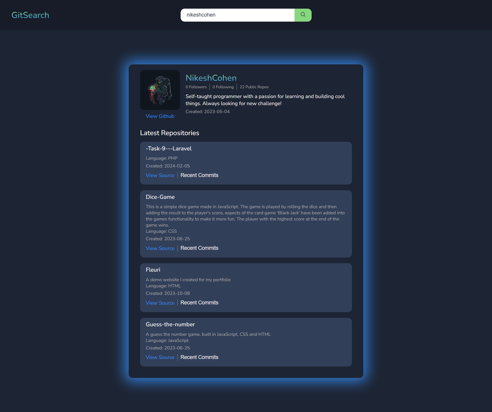

# GitSearch

GitSearch is a fullstack web application built in Javascript. It uses the GitHub RESTful API to get information about a user.

## Features

- View user information(profile picture, username, bio, following/followers, creation date)

- Four most recent public repos, with most used language, description and most recent commits

## Getting Started

- `git clone` this repo
- `cd ./server` and then run `npm i` and `npm start`
- This should open the server http://127.0.0.1:5000
- Next we need to cd into `client` and run `npm i`
- Start the react app with `npm start`

## Api Endpoints

### User

- Get user details `/api/user/:username`
- This endpoint gets all the account details of a specified user

### Repos

- Get user repos `/api/repos/:username`
- This endpoint gets all the repos from a specific user

### Commits

- Get repo commits `/api/:username/:repo/commits`
- This endpoint gets all the commits from a users specif repo
